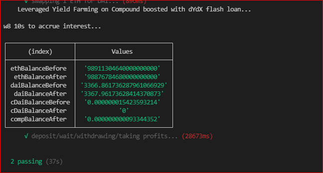

# LeveragedYieldFraming

My client asked to leverage his flash loan from [DYDX](https://dydx.exchange/) with liquidity mining, AKA yield farming on compound since [Compound protocol](https://compound.finance/) doesn't support collateral loans fro it's interface.


### To test this contract locally before running it on mainnet:

1- install dependencies by running ```npm i```

2- install ganache-cli ```npm i ganache-cli```

3- needs 2 terminals running simultaneously:
   
```ganache-cli -p 7545 -f <https://YOUR_ETH_PROVIDER>```

4- second terminal: ```truffle test```


### Logic implemented in contract as per client requirements:

- Swap ETH for DAI on [Uniswap](https://uniswap.org/).

- Deposit swapped DAI and flash loan from DYDX in contract.

- Deposit DAI in compound protocol which will earns you:

    -   Compound token 
    -   interest rate
    

- Borrow 70% DAI against total DAI deposited in compound, which will:

    - earns you compound token
    - incurs interest rate that will be paid by earned interest.

- Pay back your flash loan amount to DYDX.

- Pay back you compound loan to withdraw your collateral DAI to your contract then to your wallet.


## Successful execution should looks like below



